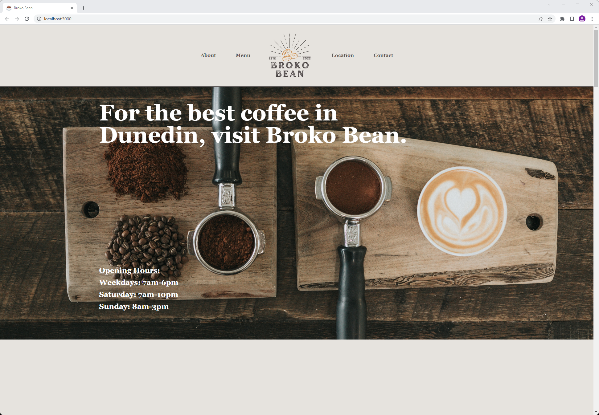

## BROKO BEAN ##

Starting with React app and Tailwind for CSS. This is a website for "Broko Bean" a cafe in Dunedin.

This is a made up cafe. The project is to make a simple, yet attractive, cafe website.

Logo made on canva, photo's from unsplash. Form uusing Formik and Yup. Deployed on Heroku

View it live: https://broko-bean.herokuapp.com/ 

